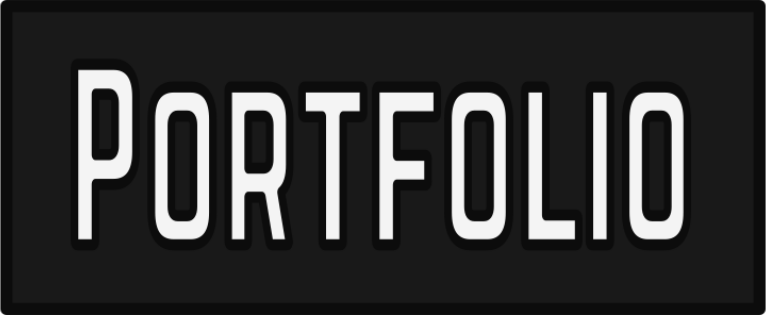
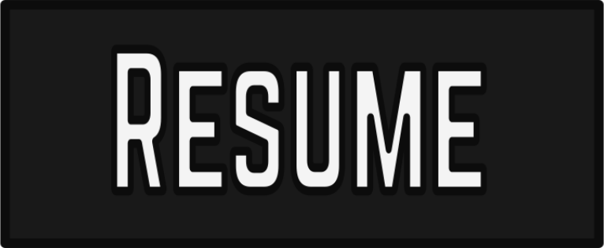
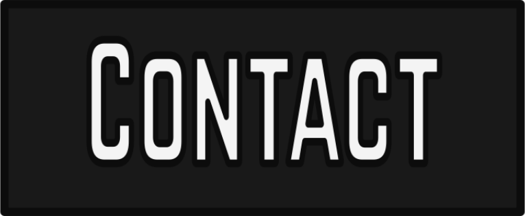

   
  

   

 <b>Would you like to know more?</b>

 

   
  

   

  
 <summmary><b>About This Image</b></summmary>
        <h3>About the Image Itself</h3>
        
The image is meant to simulate the menu of early digital cable television from the mid to late 1990s I remember as a kid. 

        
Using the style of these throwback menus gives me a good excuse for some glitch animations, which are especially fitting in this context.

        <h3>Underlying Technical Functionality</h3>
        
This SVG image is actually written essentially as a typical webpage, with HTML5 elements, an internal style sheet, inline styles and internal Javascript functionality.

        
Because GitHub's Markdown rendering engine will render SVGs, I am essentially able to change the "page's" extension to svg, embed it in an image tag and it will render on GitHub animations and all. 

        
The buttons at the bottom even work as clickable links, however you first would have to click the image and be taken to just the raw image then click the button again to see the link, thus I also provided the same links in matching buttons in the dropdown above as well.

        
<b>Note:</b> Getting the arrow keys to select menu items is still on the to-do list. As is better arranging and cleaning up the SVG's code. 

         
        

         

    
<b>Account Stats</b>

      
    
    <!--STARTS_HERE_QUOTE_README-->
<i>❝elgoog.im (Google spelled backwards) is a mirrored website of Google Search with horizontally flipped search results, also known as a “Google mirror”. An unofficial elgooG website was created by All Too Flat “for fun”, which started to gain popularity in 2002❞</i>
<!--ENDS_HERE_QUOTE_README-->
  
<!--START_SECTION:activity-->
1. 🎉 Merged PR [#176](https://github.com/Thomashighbaugh/crazy-wise-gatsby-starter/pull/176) in [Thomashighbaugh/crazy-wise-gatsby-starter](https://github.com/Thomashighbaugh/crazy-wise-gatsby-starter)
2. 🎉 Merged PR [#30](https://github.com/Thomashighbaugh/mern-contact-keeper/pull/30) in [Thomashighbaugh/mern-contact-keeper](https://github.com/Thomashighbaugh/mern-contact-keeper)
3. 🎉 Merged PR [#27](https://github.com/Thomashighbaugh/mern-contact-keeper/pull/27) in [Thomashighbaugh/mern-contact-keeper](https://github.com/Thomashighbaugh/mern-contact-keeper)
4. ❌ Closed PR [#6](https://github.com/Thomashighbaugh/mern-contact-keeper/pull/6) in [Thomashighbaugh/mern-contact-keeper](https://github.com/Thomashighbaugh/mern-contact-keeper)
5. 🎉 Merged PR [#9](https://github.com/Thomashighbaugh/mern-contact-keeper/pull/9) in [Thomashighbaugh/mern-contact-keeper](https://github.com/Thomashighbaugh/mern-contact-keeper)
<!--END_SECTION:activity-->
  
     
    

     
  

  

  
